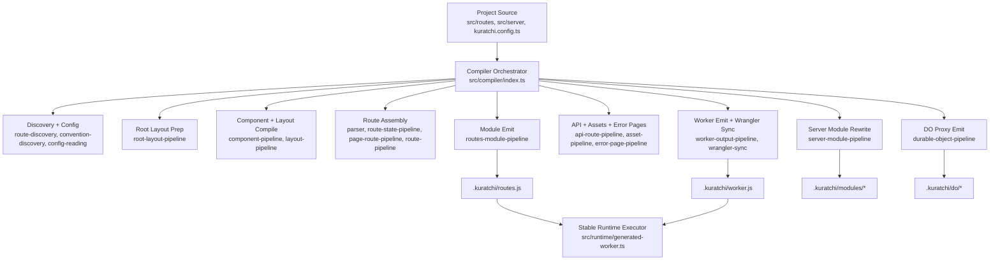

# KuratchiJS Compiler And Runtime Architecture

This document describes the current orchestration architecture for `@kuratchi/js`, why it is structured this way, and what the next production-hardening phases should be.

It is intentionally implementation-facing. The audience is framework contributors, not application developers.

## Goals

The compiler and runtime should be:

- stable under feature growth
- explicit about phase boundaries
- type-safe where semantics matter
- performant at request time
- easy to audit for correctness and security

The current architecture is built around one core rule:

> Kuratchi should generate as little framework runtime code as possible, and should model application structure with typed contracts before emitting code.

## High-Level Flow

## Current Architecture

### 1. Compiler orchestration

The compiler entrypoint is [index.ts](C:/Users/kryst/Documents/kuratchi/packages/kuratchi-js/src/compiler/index.ts).

Its job is orchestration, not deep feature logic. It is responsible for:

- locating project roots and output paths
- reading config and conventions
- coordinating route, layout, asset, and API compilation
- wiring generated outputs into `.kuratchi`
- delegating fetch/runtime behavior to the stable runtime

This is a deliberate change from the old monolith, where parsing, analysis, rewriting, and emission were interleaved in one file.

### 2. Discovery and config

Discovery and config are separated from route compilation:

- [route-discovery.ts](C:/Users/kryst/Documents/kuratchi/packages/kuratchi-js/src/compiler/route-discovery.ts)
- [convention-discovery.ts](C:/Users/kryst/Documents/kuratchi/packages/kuratchi-js/src/compiler/convention-discovery.ts)
- [config-reading.ts](C:/Users/kryst/Documents/kuratchi/packages/kuratchi-js/src/compiler/config-reading.ts)

These modules answer:

- what files exist
- which conventions are active
- which framework features must be enabled

They do not emit runtime code.

### 3. Parsing and semantic extraction

Route and layout source are parsed before emission:

- [parser.ts](C:/Users/kryst/Documents/kuratchi/packages/kuratchi-js/src/compiler/parser.ts)
- [template.ts](C:/Users/kryst/Documents/kuratchi/packages/kuratchi-js/src/compiler/template.ts)
- [script-transform.ts](C:/Users/kryst/Documents/kuratchi/packages/kuratchi-js/src/compiler/script-transform.ts)
- [import-linking.ts](C:/Users/kryst/Documents/kuratchi/packages/kuratchi-js/src/compiler/import-linking.ts)

Important current hardening decisions:

- imported function rewriting is AST-based, not regex-based
- `env` alias rewriting is AST-based, not substring-based
- import binding discovery is AST-based, not regex-based
- template metadata such as `action`, `data-poll`, `data-get`, and `data-as` is tag-tokenized, not scraped from raw regexes

This layer is where semantic correctness lives. If this layer is weak, the emitter will generate the wrong program regardless of how clean the output printer is.

### 4. Component and layout pipelines

Component and layout work is isolated:

- [component-pipeline.ts](C:/Users/kryst/Documents/kuratchi/packages/kuratchi-js/src/compiler/component-pipeline.ts)
- [layout-pipeline.ts](C:/Users/kryst/Documents/kuratchi/packages/kuratchi-js/src/compiler/layout-pipeline.ts)
- [root-layout-pipeline.ts](C:/Users/kryst/Documents/kuratchi/packages/kuratchi-js/src/compiler/root-layout-pipeline.ts)

Responsibilities include:

- component compilation and caching
- component action-prop discovery
- layout render wrapping
- root HTML shell preparation
- browser bridge injection

Current hardening decisions:

- root layout injection uses explicit shell slots instead of ad hoc repeated string replacement
- layout head handling is explicit and passed through render contracts
- page fragments are produced by the compiler and consumed by the runtime as a manifest, not rediscovered from rendered HTML

### 5. Route assembly

Route compilation is split across multiple phases:

- [route-state-pipeline.ts](C:/Users/kryst/Documents/kuratchi/packages/kuratchi-js/src/compiler/route-state-pipeline.ts)
- [page-route-pipeline.ts](C:/Users/kryst/Documents/kuratchi/packages/kuratchi-js/src/compiler/page-route-pipeline.ts)
- [route-pipeline.ts](C:/Users/kryst/Documents/kuratchi/packages/kuratchi-js/src/compiler/route-pipeline.ts)
- [api-route-pipeline.ts](C:/Users/kryst/Documents/kuratchi/packages/kuratchi-js/src/compiler/api-route-pipeline.ts)

This separation exists to keep these concerns distinct:

- route and nested layout merge state
- page render preparation
- action and RPC registration
- route object emission
- API route handling

This is the layer that fixed earlier classes of bugs where imported helpers, actions, and load variables were bleeding into one another.

### 6. Server module transformation

Private server modules are rewritten through:

- [server-module-pipeline.ts](C:/Users/kryst/Documents/kuratchi/packages/kuratchi-js/src/compiler/server-module-pipeline.ts)

This layer handles:

- rewriting internal server imports into compiled `.kuratchi/modules/*`
- redirecting Durable Object imports through generated proxies
- preserving module boundaries without leaking raw source paths into emitted route code

### 7. Feature-specific compilation

Specialized outputs stay in dedicated pipelines:

- [asset-pipeline.ts](C:/Users/kryst/Documents/kuratchi/packages/kuratchi-js/src/compiler/asset-pipeline.ts)
- [error-page-pipeline.ts](C:/Users/kryst/Documents/kuratchi/packages/kuratchi-js/src/compiler/error-page-pipeline.ts)
- [durable-object-pipeline.ts](C:/Users/kryst/Documents/kuratchi/packages/kuratchi-js/src/compiler/durable-object-pipeline.ts)

This keeps feature logic out of the core route path unless the feature is actually used.

### 8. Module emission

Generated route module emission is coordinated by:

- [routes-module-pipeline.ts](C:/Users/kryst/Documents/kuratchi/packages/kuratchi-js/src/compiler/routes-module-pipeline.ts)
- [routes-module-feature-blocks.ts](C:/Users/kryst/Documents/kuratchi/packages/kuratchi-js/src/compiler/routes-module-feature-blocks.ts)
- [routes-module-runtime-shell.ts](C:/Users/kryst/Documents/kuratchi/packages/kuratchi-js/src/compiler/routes-module-runtime-shell.ts)
- [routes-module-types.ts](C:/Users/kryst/Documents/kuratchi/packages/kuratchi-js/src/compiler/routes-module-types.ts)

This layer now builds:

- route registrations
- manifest-like feature blocks
- thin wiring into the stable runtime executor

It does not own the request lifecycle itself.

### 9. Stable runtime

The request lifecycle now lives in normal framework source:

- [generated-worker.ts](C:/Users/kryst/Documents/kuratchi/packages/kuratchi-js/src/runtime/generated-worker.ts)
- [router.ts](C:/Users/kryst/Documents/kuratchi/packages/kuratchi-js/src/runtime/router.ts)
- [types.ts](C:/Users/kryst/Documents/kuratchi/packages/kuratchi-js/src/runtime/types.ts)
- [action.ts](C:/Users/kryst/Documents/kuratchi/packages/kuratchi-js/src/runtime/action.ts)
- [request.ts](C:/Users/kryst/Documents/kuratchi/packages/kuratchi-js/src/runtime/request.ts)
- [context.ts](C:/Users/kryst/Documents/kuratchi/packages/kuratchi-js/src/runtime/context.ts)
- [page-error.ts](C:/Users/kryst/Documents/kuratchi/packages/kuratchi-js/src/runtime/page-error.ts)

This is one of the biggest architecture wins.

Instead of generating a large framework fetch shell per build, Kuratchi now:

- keeps the request engine in framework source
- generates route/feature registrations
- passes typed render results into the runtime

This improves:

- auditability
- testability
- request-time consistency
- security review surface

## Current Contracts

These are the most important contracts in the current system:

### Parsed file contract

`parseFile()` returns route/layout metadata such as:

- server script
- client script imports
- explicit load function
- action functions
- query metadata
- poll functions
- top-level data variables

This is the first semantic boundary in the compiler.

### Render contract

Page rendering is no longer "just HTML".

The runtime render contract in [types.ts](C:/Users/kryst/Documents/kuratchi/packages/kuratchi-js/src/runtime/types.ts) supports:

- `html`
- `head`
- `fragments`

This removed fragile runtime HTML scraping for:

- `<head>` extraction
- poll fragment refreshes

### Runtime registration contract

The compiler emits route and feature registrations consumed by the stable runtime. This keeps application-specific codegen separate from framework lifecycle logic.

### Top-level realm contract

Top-level route, nested layout, and root layout `<script>` blocks support explicit import realms:

- `$server/*` — Server-only code (RPC functions, DB access)
- `$lib/*` — Isomorphic code (works in server templates AND client scripts)

Current rules:

- `$server` imports are server-only and may participate in load, actions, RPC, and SSR.
- `$lib` imports are isomorphic and may be used in SSR templates and in client `<script type="module">` blocks.

Current supported browser usage from the top-level route script:

- direct event handler references such as `onclick={copyText}`
- direct event handler calls such as `onclick={copyText(value)}`
- member calls on imported namespaces such as `onclick={clipboard.copy(value)}`

Current unsupported browser usage:

- namespace imports like `import * as api from '$server/foo'` in browser code

When top-level `$lib` handlers are used in template events, the compiler:

- emits route-scoped browser module assets under `.kuratchi`
- injects a `<script type="module">` tag for the route asset through the render contract
- registers handlers into the root browser bridge
- rewrites matching event attributes into `data-client-*` metadata instead of inline JS strings

Inline template `<script type="module">` blocks are the preferred path for client-side DOM manipulation.

## Output Model

Kuratchi generates these primary outputs:

| Output | Purpose |
|---|---|
| `.kuratchi/routes.js` | compiled route definitions, handlers, render functions, registrations |
| `.kuratchi/worker.js` | stable Worker entry used by Wrangler |
| `.kuratchi/modules/*` | transformed server-side modules |
| `.kuratchi/client/*` | browser modules for `$lib` handlers and inline client scripts |
| `.kuratchi/do/*` | generated Durable Object proxies |

The generated code should primarily describe the application, not re-implement the framework runtime.

## What Was Hardened Recently

These were the key architecture improvements in the recent refactor:

- compiler monolith extracted into dedicated pipelines
- stable runtime executor introduced
- page `head` became an explicit render output
- fragments became a compiler-produced manifest instead of HTML scraping
- static route lookup restored in the shared router
- runtime hook registration cached at runtime startup
- imported function/env rewrites moved from regex to AST transforms
- import parsing moved from regex to AST analysis
- template metadata discovery moved from regex scraping to tokenized tags/attrs
- root layout shell injection moved toward explicit slots

## Known Strengths

The current architecture is materially better than the original monolith in these ways:

- semantics are less coupled to output formatting
- route/build phases are easier to change in isolation
- runtime logic is auditable as real source code
- request behavior is easier to benchmark and test
- the most brittle string-rewrite paths have been removed from core compiler semantics

## Known Limitations

The system is improved, but not "done".

Current limitations:

- some emitter paths are still string-heavy, especially around template emission and browser bridge generation
- `parser.ts` and `template.ts` are still dense and should be treated as sensitive areas
- route analysis is improved but does not yet flow through a single first-class typed IR for every phase
- some generated JS is still assembled through manual string templates rather than AST printers
- performance work is still mostly based on structural reasoning and targeted tests, not formal benchmarks

## Implementation Roadmap

This section is the tracked roadmap for the compiler/runtime core.

Status meanings:

- `done`: implemented and validated in the current architecture
- `next`: highest-priority upcoming work
- `planned`: important follow-up work with clear value
- `later`: valuable, but dependent on earlier infrastructure or lower urgency

### Current status snapshot

| Track | Status | Why it matters |
|---|---|---|
| Compiler extraction into pipelines | `done` | removes the main monolith and clarifies phase ownership |
| Stable runtime executor | `done` | keeps request lifecycle in framework source, not generated shells |
| AST script and import semantics | `done` | removes the highest-risk regex rewrites |
| Head and fragment render contracts | `done` | removes fragile runtime HTML scraping |
| First-class compiler IR | `next` | creates the strongest long-term correctness boundary |
| Golden fixture compiler tests | `next` | catches semantic regressions before they ship |
| RPC transport hardening | `planned` | strongest immediate runtime security improvement |
| Request-path benchmarking | `planned` | replaces assumptions with measured runtime data |
| Selective AST emission | `planned` | reduces symbol-sensitive string assembly risk |
| Browser bridge manifesting | `later` | shrinks a still string-heavy runtime boundary |
| Incremental compile invalidation | `later` | improves rebuild performance once compiler contracts are stronger |

### Phase 1: First-class compiler IR

Status: `next`

Priority: `P0`

Goal:

Create a typed intermediate representation that survives across discovery, parsing, analysis, validation, and emission.

Scope:

- route identity and pattern
- merged layout ancestry
- load bindings
- action bindings
- RPC bindings
- component dependencies
- render sections
- fragment manifest
- error page hooks
- runtime requirements

Dependencies:

- current pipeline extraction

Why this phase exists:

- it makes invariants explicit
- it prevents semantic leakage between passes
- it gives tests a stable artifact to validate before code emission

Exit criteria:

- every route compiles through an explicit IR object before final emission
- load, action, RPC, and render metadata are separate typed fields, not inferred again during emit
- invariant checks run on IR before generating route code
- at least one fixture test snapshots IR for representative route shapes

### Phase 2: Golden fixture compiler tests

Status: `next`

Priority: `P0`

Goal:

Add fixture-based end-to-end compiler tests that snapshot semantic outputs, not just individual helpers.

Scope:

- parsed route metadata
- route registrations
- render outputs
- fragment manifests
- transformed server modules
- runtime wiring and feature flags

Dependencies:

- benefits from Phase 1, but can begin before it is fully complete

Why this phase exists:

- compiler regressions are often semantic, not syntax-level
- fixture apps catch cross-phase failures that unit tests miss

Exit criteria:

- fixture suite covers static routes, dynamic routes, nested layouts, actions, RPC, fragments, error pages, and server-module rewrites
- snapshots are stable and intentionally reviewed
- at least one integration fixture compiles a realistic mini app, not just isolated route files

### Phase 3: RPC transport and security hardening

Status: `planned`

Priority: `P1`

Goal:

Tighten the runtime security boundary around RPC execution.

Scope:

- stronger request validation
- clearer same-origin guarantees
- improved CSRF posture where applicable
- explicit auth/guard surfaces for RPC handlers

Dependencies:

- none required, but runtime contract clarity from current architecture helps

Why this phase exists:

- centralized runtime logic makes this practical now
- RPC is the most obvious remaining high-value runtime hardening area

Exit criteria:

- RPC entry rules are explicit and documented
- invalid or cross-origin misuse paths are rejected consistently
- runtime tests cover successful RPC, rejected RPC, and auth/guard behavior

### Phase 4: Request-path benchmarks

Status: `planned`

Priority: `P1`

Goal:

Measure request-path cost so runtime changes are guided by data.

Scope:

- static route hit
- dynamic route hit
- action POST
- RPC request
- 404 path
- fragment refresh

Dependencies:

- stable runtime executor already makes this possible

Why this phase exists:

- performance assumptions are weak without repeatable measurements
- benchmarks help keep future hardening work from introducing accidental regressions

Exit criteria:

- benchmark harness exists in-repo
- baseline numbers are recorded for the main request paths
- future runtime work can be compared against those baselines

### Phase 5: Selective AST emission

Status: `planned`

Priority: `P1`

Goal:

Reduce symbol-sensitive string assembly in emitted JS without forcing AST generation everywhere.

Scope:

- imports
- exports
- route registrations
- action maps
- handler maps
- other symbol-sensitive sections

Dependencies:

- strongly benefits from Phase 1 IR

Why this phase exists:

- AST is most valuable where identifiers and module bindings matter
- plain strings are still acceptable for small static leaf snippets

Exit criteria:

- symbol-sensitive emit sections no longer depend on manual string stitching
- emitted code remains readable and stable under snapshots
- no regression in build correctness for existing fixture coverage

### Phase 6: Browser bridge manifest and config-driven runtime wiring

Status: `later`

Priority: `P2`

Goal:

Shrink the remaining string-heavy browser bridge by moving more behavior behind stable runtime code and generated descriptors.

Scope:

- compiler-emitted bridge feature flags
- compiler-emitted query/poll/action descriptors
- smaller runtime bridge configuration surface

Dependencies:

- easier after Phase 1 and Phase 5

Why this phase exists:

- the browser bridge is still one of the denser string-assembly areas
- a manifest-driven bridge will be easier to test and evolve

Exit criteria:

- bridge behavior is driven by structured config instead of broad inline code generation
- string-heavy generated bridge sections are materially reduced
- fragments, refresh, and action UX remain functionally unchanged

### Phase 7: Incremental compile and watch invalidation

Status: `later`

Priority: `P2`

Goal:

Use the new compiler boundaries to support smarter rebuilds.

Scope:

- route-only rebuilds
- layout ancestry rebuilds
- server module graph rebuilds
- component cache invalidation

Dependencies:

- Phase 1 IR
- stronger fixture coverage from Phase 2

Why this phase exists:

- performance work at compile time benefits from explicit dependency boundaries
- invalidation is safer once semantic ownership is clearly modeled

Exit criteria:

- watch mode can rebuild only the affected graph slice
- layout or server-module changes invalidate the right dependents
- incremental rebuild logic is covered by targeted tests

### Sequencing rules

The roadmap should generally be executed in this order:

1. Phase 1: first-class compiler IR
2. Phase 2: golden fixture compiler tests
3. Phase 3: RPC transport and security hardening
4. Phase 4: request-path benchmarks
5. Phase 5: selective AST emission
6. Phase 6: browser bridge manifesting
7. Phase 7: incremental compile invalidation

This order is intentional:

- Phase 1 and Phase 2 improve correctness and change safety first
- Phase 3 and Phase 4 harden runtime behavior once the architecture is stable
- Phase 5 through Phase 7 build on those stronger compiler contracts

## Contributor Rules

When changing the compiler/runtime, prefer these rules:

- do not add new regex-based semantic rewrites if AST or tokenized structure is available
- keep framework request lifecycle logic in stable runtime files when possible
- add a new pipeline only when it creates a real phase boundary, not just another helper file
- prefer typed contracts and invariants over ad hoc string conventions
- if a feature needs heavy inference, consider making part of it explicit instead of stacking more heuristics
- when changing route semantics, add a fixture or runtime test in the same change

## Practical Definition Of Done

A change to the compiler/runtime is in a good state when:

- phase ownership is clear
- generated code surface is minimized
- runtime behavior is implemented in stable source where possible
- test coverage includes the semantic behavior that can regress
- the change does not reintroduce regex- or substring-based compiler semantics

That is the direction Kuratchi should keep following if the goal is to be production-grade and stay stable under framework growth.
